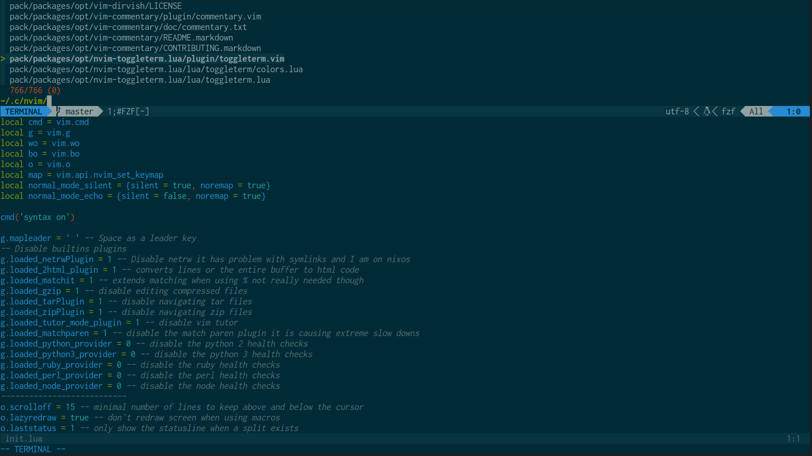
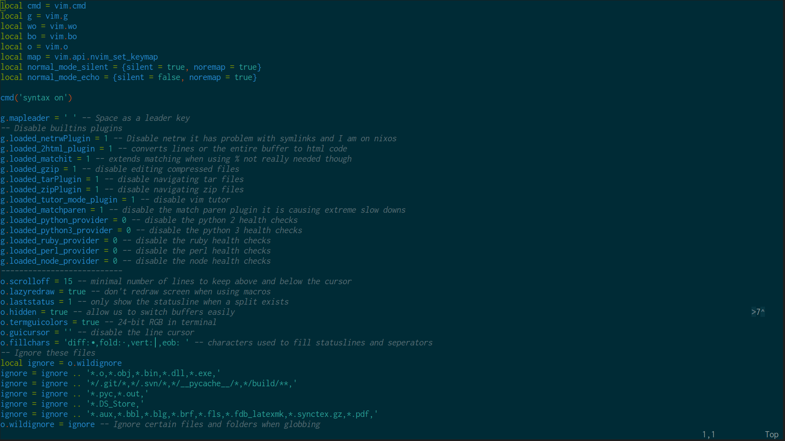
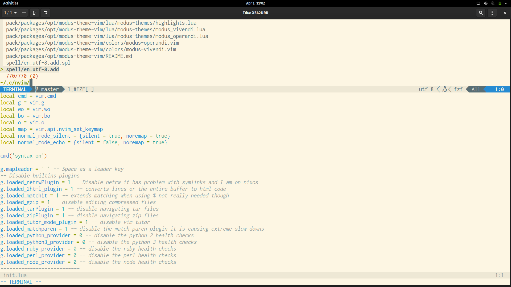
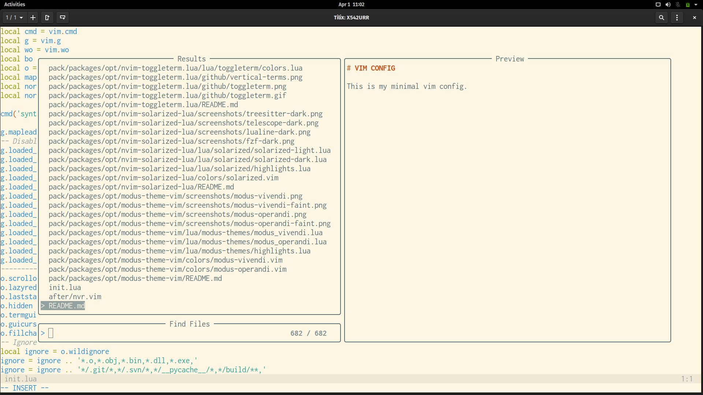
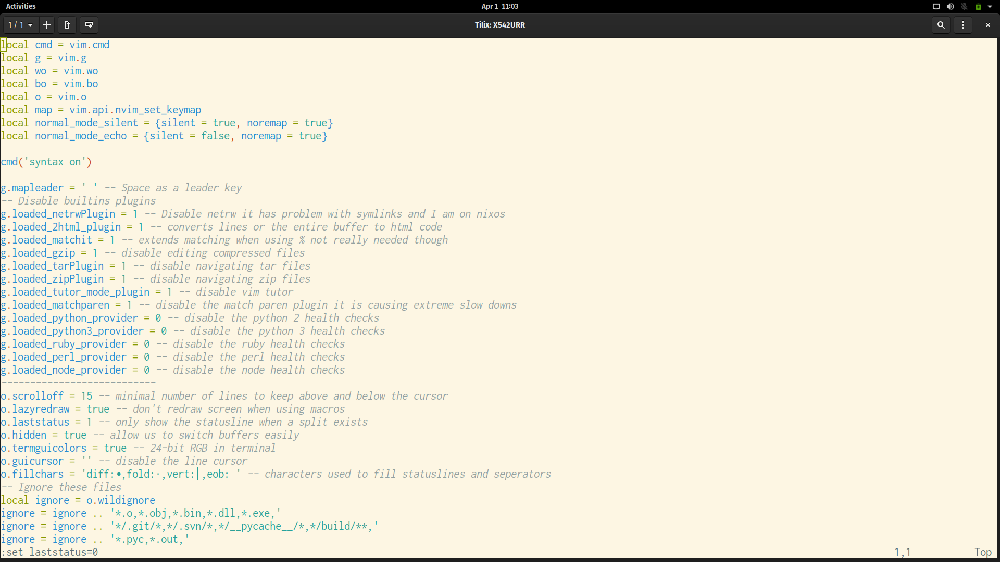
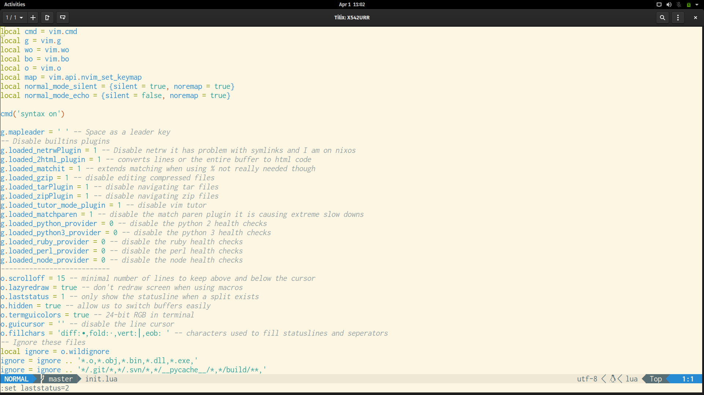

# Solarized Neovim

Solarized in lua for neovim.

## Dark Theme


fzf


telescope


treesitter


lualine
```lua
require('lualine').setup{
    options = {theme = 'solarized'}
}
```

## Light Theme



fzf


telescope


treesitter


lualine
```lua
require('lualine').setup{
    options = {theme = 'solarized'}
}
```

## TODO

- ~~The light colorscheme~~
- Features from vim-solarized8
- 0.5 features
   + LSP
   + ~~TS~~
   + ~~Telescope~~
   + ~~lualine~~
