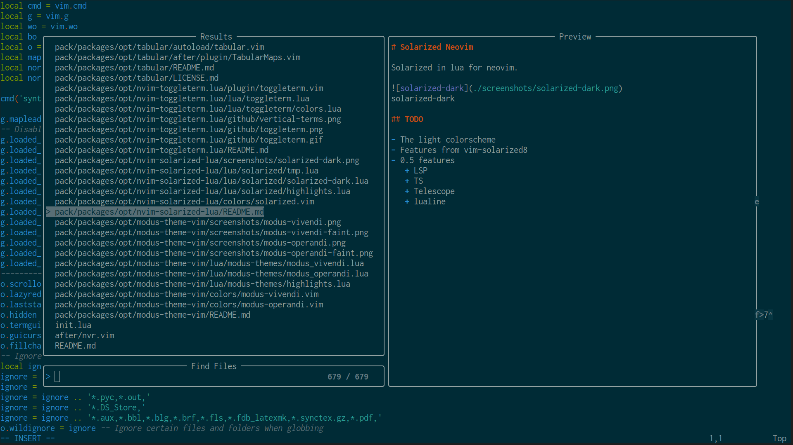

# Solarized Neovim

Solarized in lua for neovim.

## Dark Theme

fzf

telescope

treesitter

## TODO

- The light colorscheme
- Features from vim-solarized8
- 0.5 features
   + LSP
   + ~~TS~~
   + ~~Telescope~~
   + ~~lualine~~
